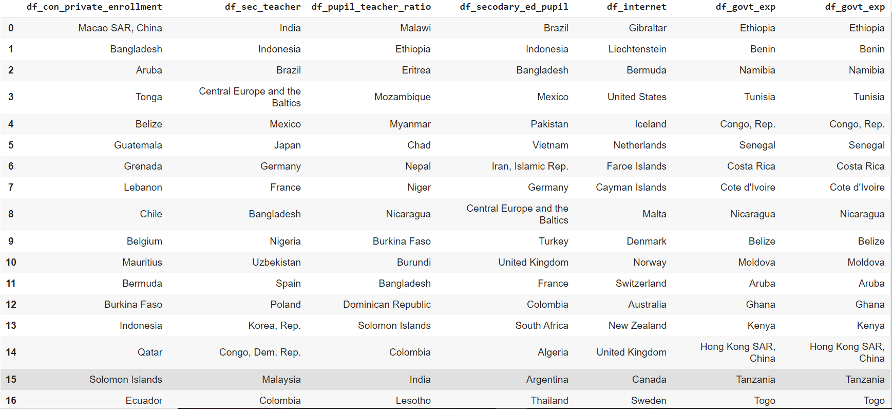
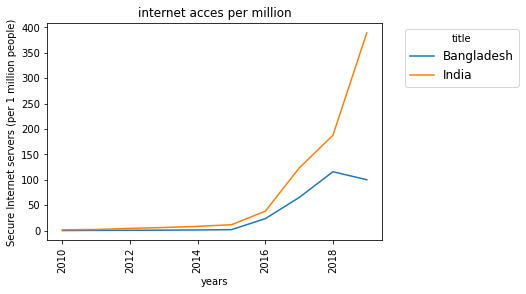
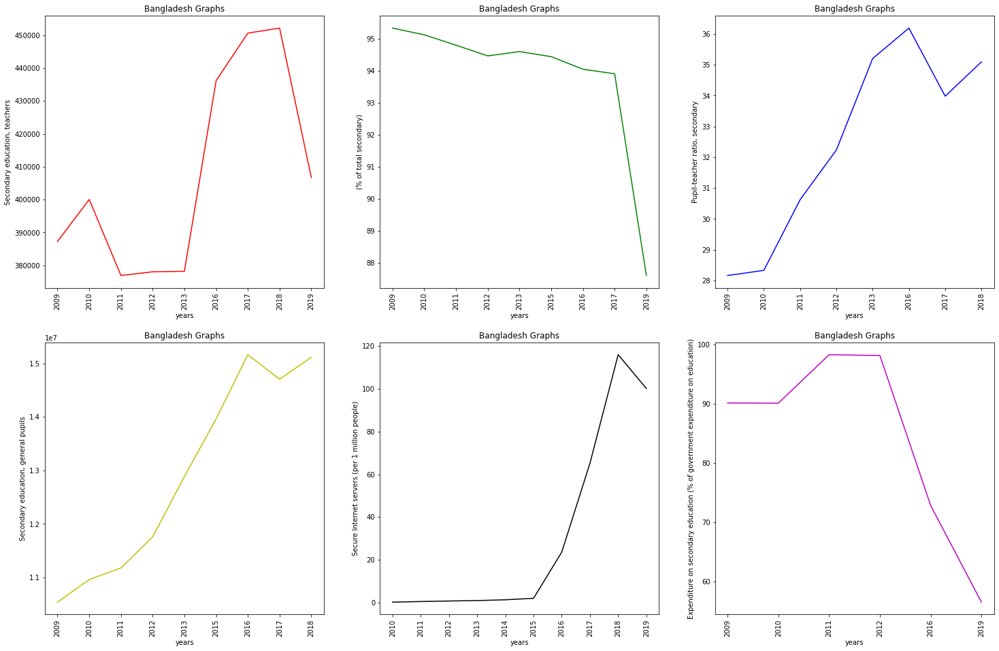

Skip to content
Search or jump to…

Pull requests
Issues
Marketplace
Explore
 
@tejas-droid 
Learn Git and GitHub without any code!
Using the Hello World guide, you’ll start a branch, write comments, and open a pull request.


tejas-droid
/
skill-build-
1
01
Code
Issues
Pull requests
Actions
Projects
Wiki
Security
Insights
Settings
skill-build-
/
readMe.md
 

Spaces

1

Soft wrap
1
# Apply exploratory analysis with Python for Business Values
2
Values Skills: Data pre-processing, descriptive statistics, Python 
3
# Task
4
The manager invited you to a meeting to introduce you to the company's international expansion project. He asks you to do an exploratory analysis to see if the education data of the World Bank can inform the academy's expansion project.Here are the questions you have been asked to explore:   
5
 ● Which countries have a high customer potential for our services?    
6
 ● For each of these countries, what will be the evolution of this customer potential?   
7
 ● In which countries should one set up first?
8
​
9
# Tech 
10
 Google collab - To perform the  data analysis
11
​
12
 # Intsallation or Libraries
13
```bash
14
pip install pandas 
15
pip install matplotlib
16
pip install -U wbdat #Api for accessing the world bank data
17
 ```
18
 ### Importing the libraries 
19
 ```python
20
 import pandas as pd
21
 import matplotlib.pyplot as plt
22
 import wbdata
23
 ```
24
 Fetching the data 
25
 ```python
26
wbdata.get_source() #data source available in world bank data 
27
wbdata.get_source(12) #the source required for this project 12 = Education Statistics
28
wbdata.get_indicator(source=12)
29
df = wbdata.get_dataframe(indicator, country=(list of country),convert_date=False )
30
 ```
31
 ### The following indicators which include the secondary or high school students education status of different countries over the past years.
32
* School enrollment, secondary, private (% of total secondary)
33
* Secondary education, teachers
34
* Pupil-teacher ratio, secondary
35
* Secondary education, general pupils
36
* Secure Internet servers (per 1 million people)
37
* Government expenditure on education, total (% of government expenditure)
38
* Expenditure on secondary education (% of government expenditure on education)
39
​
40
# The following data frame indicates list of countries sorted according to values under each indicator.
41
```python
42
df_country.head(16)
43
```
44

45
​
46
## Based on the above dataframe which contains the countries list in sorted descending order. 
47
## Dividing countries based on the continents
48
### Asia 
49
### Bangladesh, India, Pakisthan, Nepal, Srilanka, China.
50
## Europe 
51
### Germany, France, Ukraine, Irleand, Poland, Finland, UK.
52
## America
53
### USA, Brazil, Cuba, Columbia, Argentina.
54
​
55
### Performing data visualization based on the indicators and comparing it with different countries.
56
```python
57
plot1(["IN",'BD'],internet_ind,"internet acces per million")
58
#the following function takes in input as(country, indicator,title for graph) and provides a line graph over years 2009-2019 as per the data available.
59
​
60
```
61

62
```python
63
onecon(['BD'],"Bangladesh Graphs")#the following functions takes in the parameter(one country alpha code as list, title)and provides the variation of each parameters over years 
64
```
65

66
​
67
# Conclusions
68
[google Collab link](https://github.com/tejas-droid/skill-build-/blob/main/edstatsanalysis.ipynb)
69
 * ### From the above exploration we can note that after considering some of the major features like internet and other sub features we can say in Asia the best countries would        be Bangladesh, China and India.
70
 * ### From the above exploration it can been seen that Brazil and USA in America.
71
 * ### From the above exploration it can been seen that Poland, Britain and Finland in Europe.
72
​
@tejas-droid
Commit changes
Commit summary
Update readMe.md
Optional extended description
Add an optional extended description…
 Commit directly to the main branch.
 Create a new branch for this commit and start a pull request. Learn more about pull requests.
 
© 2021 GitHub, Inc.
Terms
Privacy
Security
Status
Help
Contact GitHub
Pricing
API
Training
Blog
About
